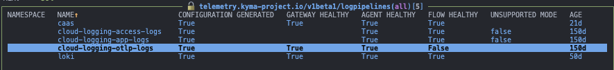
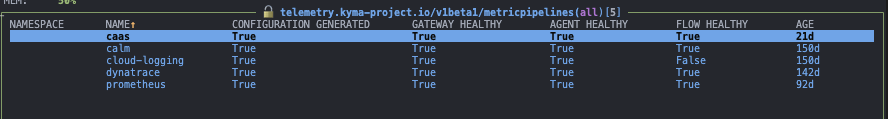

# FIPS-140-3 Compliance

## Observed Behavior

FIPS-140 observed behavior, when enabling it using:
```bash
GOFIPS=v1.0.0
GODEBUG=fips140=only
```

### telemetry-manager

🛑 ERROR: When running `telemetry-manager` in a K3D cluster:

```
{"level":"ERROR","timestamp":"2025-08-25T13:54:01Z","logger":"setup","caller":"telemetry-manager-workspace/main.go:122","
message":"Manager exited with error","error":"failed to setup manager: failed to determine if *v1.NetworkPolicy is namesp
aced: failed to get restmapping: failed to get server groups: Get \"https://10.43.0.1:443/api\": crypto/ecdh: use of X255
19 is not allowed in FIPS 140-only mode"}
```

🛑 ERROR: When running `telemetry-manager` in a Gardener cluster:

```
{"level":"ERROR","timestamp":"2025-08-25T13:46:53Z","logger":"setup","caller":"telemetry-manager-workspace/main.go:122","
message":"Manager exited with error","error":"failed to setup manager: failed to determine if *v1.Deployment is namespaced: failed to get restmapping: failed to get server groups: Get \"https://api.teo-1.berlin.internal.canary.k8s.ondemand.com:443/api\": crypto/ecdh: use of X25519 is not allowed in FIPS 140-only mode"} 
```

> NOTE: There's currently no focus group in Gardener on the FIPS topic

✅ SOLUTION: Need to downgrade Go to version 1.24.6 to bypass this error.

🛑 ERROR: Use of SHA-1 in `telemetry-manager/internal/webhookcert/ca_cert_generator.go`
```
{"level":"INFO","timestamp":"2025-08-26T09:35:35Z","caller":"webhookcert/ca_cert_provider.go:66","message":"Generating new CA cert/key","secretName":"telemetry-webhook-cert","secre
tNamespace":"kyma-system"}                                                                                                                                                          
panic: crypto/sha1: use of SHA-1 is not allowed in FIPS 140-only mode                                                                                                               
                                                                                                                                                                                    
goroutine 1 [running]:                                                                                                                                                              
crypto/sha1.Sum({0xc00070a900?, 0x5?, 0x0?})                                                                                                                                        
    /usr/local/go/src/crypto/sha1/sha1.go:273 +0x128                                                                                                                                
crypto/x509.CreateCertificate({0x1fe9f40, 0xc000135040}, 0xc0002069d0, 0xc0002069d0, {0x1aa7100, 0xc0002683f0}, {0x1bcfa20?, 0xc0002683f0})                                         
    /usr/local/go/src/crypto/x509/x509.go:1744 +0x60a                                                                                                                               
github.com/kyma-project/telemetry-manager/internal/webhookcert.(*caCertGeneratorImpl).generateCertInternal(0xc000483e90)                                                            
    /telemetry-manager-workspace/internal/webhookcert/ca_cert_generator.go:68 +0x2b6                                                                                                
github.com/kyma-project/telemetry-manager/internal/webhookcert.(*caCertGeneratorImpl).generateCert(0x200b720?)                                                                      
    /telemetry-manager-workspace/internal/webhookcert/ca_cert_generator.go:25 +0x17                                                                                                 
github.com/kyma-project/telemetry-manager/internal/webhookcert.(*caCertProviderImpl).provideCert(0xc0002079c0, {0x2006ac0, 0x2f67340}, {{0xc000058012?, 0x90?}, {0x1d2c5c6?, 0xc0003
962d0?}})                                                                                                                                                                           
    /telemetry-manager-workspace/internal/webhookcert/ca_cert_provider.go:70 +0x2fe                                                                                                 
github.com/kyma-project/telemetry-manager/internal/webhookcert.EnsureCertificate({0x2006ac0, 0x2f67340}, {0x20122c0, 0xc0003962d0}, {0x1000, {0x7fffb4f33856, 0x4}, {{0xc000058012, 
0xb}, {0x1d31079, ...}}, ...})                                                                                                                                                      
    /telemetry-manager-workspace/internal/webhookcert/webhook_cert.go:41 +0x1a6                                                                                                     
main.ensureWebhookCert({0x2016338?, 0xc000488700?}, {{0x1000, {0x7fffb4f33856, 0x4}, {{0xc000058012, 0xb}, {0x1d31079, 0x19}}, {{0xc000058012, ...}, ...}, ...}})                   
    /telemetry-manager-workspace/main.go:519 +0x12c                                                                                                                                 
main.setupControllersAndWebhooks({0x2016338, 0xc000488700})                                                                                                                         
    /telemetry-manager-workspace/main.go:200 +0x68f                                                                                                                                 
main.run()                                                                                                                                                                          
    /telemetry-manager-workspace/main.go:152 +0x125                                                                                                                                 
main.main()                                                                                                                                                                         
    /telemetry-manager-workspace/main.go:121 +0x13 
```

✅ SOLUTION: Manually generate the `subjectKey` from the `caCertTemplate` using the ASN.1 `x509.MarshalPKIXPublicKey` marshaller, which instead of the default SHA.1-based algorithm (not FIPS-compliant), uses the elliptic curve algorithms. See: https://pkg.go.dev/crypto/x509#MarshalPKIXPublicKey. Changes found in: https://github.com/kyma-project/telemetry-manager/pull/2440

> NOTE: This might fail again on Go 1.25, where elliptic curve algorithms are considered non-compliant.

🔵 INFO: At this point, telemetry-manager is stable in idle mode

🔵 INFO: Integration testsuite succeeds

🔵 INFO: Testing on the e2e cluster(stage/c-2bb323d)...
- telemetry-manager runs consistently, reporting no errors
- pipelines are not affected by the image change
- pipelines' flows are unaffected by the image change. Observed unhealthy flow for one metric and log pipeline, but this also happened with the non-FIPS image (see pictures below).



### telemetry-manager/dependencies/telemetry-self-monitor
From: europe-docker.pkg.dev/kyma-project/prod/tpi/telemetry-self-monitor:3.5.0-8d9d348 \
To: europe-docker.pkg.dev/kyma-project/dev/tpi/telemetry-self-monitor:PR-2440

🔵 INFO: Tested on the e2e cluster(stage/c-2bb323d), no malfunctioning detected

### telemetry-manager/dependencies/directory-size-exporter
From: europe-docker.pkg.dev/kyma-project/prod/directory-size-exporter:v20250724-d99b68f4 \
To: europe-docker.pkg.dev/kyma-project/dev/directory-size-exporter:PR-2440

🔵 INFO: Tested on the e2e cluster(stage/c-2bb323d), no malfunctioning detected

### telemetry-manager/opentelemetry-collector-components
From: europe-docker.pkg.dev/kyma-project/prod/kyma-otel-collector:0.132.0-1.46.0 \
To: europe-docker.pkg.dev/kyma-project/dev/kyma-otel-collector:PR-390

🔵 INFO: Tested on the e2e cluster(stage/c-2bb323d), no malfunctioning detected

### consumption-reporter

TODO

## Conclusions
- We are still early adopters of FIPS-140-3
- Gardener and k3s don't seem to have any planned support for FIPS-140-3 as of now
- Downgrading Go to 1.24.6 seems to be a stable workaround for now
- On our side, telemetry-manager is the only component affected by FIPS-140-3, requiring a code change to avoid SHA-1 usage
- No issues observed with telemetry-self-monitor, directory-size-exporter, and otel-collector after enabling FIPS-140