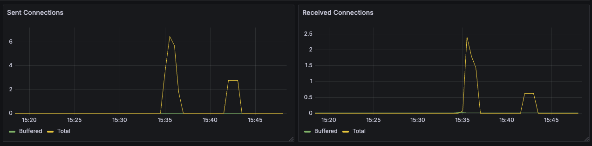

## Observed metrics
Envoy: https://www.envoyproxy.io/docs/envoy/latest/configuration/observability/statistics \
Istio: https://istio.io/latest/docs/reference/config/metrics/

Default (K8S):
- CPU Usage / CPU Throttling
- Memory Usage (WSS)
- Receive Bandwidth
- Transmit Bandwidth
- Rate of Received Packets
- Rate of Transmitted Packets
- Rate of Packets Dropped (Received + Transmitted)

Envoy (Server):
- `envoy_server_memory_allocated` = Current amount of allocated memory in bytes. Total of both new and old Envoy processes on hot restart.
- `envoy_server_memory_heap_size` = Current reserved heap size in bytes. New Envoy process heap size on hot restart.
- `envoy_server_memory_physical_size` = Current estimate of total bytes of the physical memory. New Envoy process physical memory size on hot restart.
- `envoy_server_total_connections` = Total connections of both new and old Envoy processes.
- *(not always reported)* `envoy_server_initialization_time_ms` = Total time taken for Envoy initialization in milliseconds. This is the time from server start-up until the worker threads are ready to accept new connections.
- `envoy_server_envoy_bug_failures` = Number of envoy bug failures detected in a release build. File or report the issue if this increments as this may be serious.
- load-test/nginx/istio-proxy: CPU Usage, CPU Throttling, Memory Usage (`Dashboards > Kubernetes / Compute Resources / Pod`)

Envoy (Cluster):
- `envoy_cluster_upstream_cx_max_requests` = Total connections closed due to maximum requests
- `envoy_cluster_upstream_cx_protocol_error` = Total connection protocol errors
- `envoy_cluster_upstream_cx_destroy` = Total destroyed connections
- `envoy_cluster_upstream_bytes` = Total sent/received connection bytes + Received/Sent connection bytes currently buffered

Istio:
- *(not measured)* Request Count (`istio_requests_total`): This is a COUNTER incremented for every request handled by an Istio proxy.
- *(not measured)* Request Duration (`istio_request_duration_milliseconds`): This is a DISTRIBUTION which measures the duration of requests.
- *(not measured)* Request Size (`istio_request_bytes`): This is a DISTRIBUTION which measures HTTP request body sizes.
- *(not measured)* Response Size (`istio_response_bytes`): This is a DISTRIBUTION which measures HTTP response body sizes.
- *(not measured)* gRPC Request Message Count (`istio_request_messages_total`): This is a COUNTER incremented for every gRPC message sent from a client.
- *(not measured)* gRPC Response Message Count (`istio_response_messages_total`): This is a COUNTER incremented for every gRPC message sent from a server.

## Results

### 📊 Run R01 - Comparing the two providers
- 22-Apr-2025
- **Scenario:** Comparing (old) `envoy` provider with (new) `kyma-logs` provider 
- Load Generator (fortio): `["load", "-t", "10m", "-qps", "0", "-nocatchup", "-uniform", "nginx.load-test.svc"]` (no catchup)

#### 🅿️ kyma-logs
- `envoy_server_memory_allocated` / `envoy_server_memory_heap_size` / `envoy_server_memory_physical_size` (MB): 10.1 / 16 / 21.3
- `envoy_server_total_connections` (average): 3.25
- `envoy_server_initialization_time_ms`: ?
- `envoy_server_envoy_bug_failures`: 0
- `envoy_server_uptime`: 8.4K - 9.4K
- `envoy_cluster_upstream_cx_max_requests`: 7.25
- `envoy_cluster_upstream_cx_protocol_error`: 6.25
- `envoy_cluster_upstream_cx_destroy`: 6.25
- `envoy_cluster_upstream_bytes` (KB): 

|     Pod     | CPU Usage | CPU Throttling | Memory Usage (WSS) | Receive Bandwidth | Transmit Bandwidth | Rate of Received Packets | Rate of Transmitted Packets | Rate of Packets Dropped (Received + Transmitted) |
| :---------: | :-------: | :------------: | :----------------: | :---------------: | :----------------: | :----------------------: | :-------------------------: | :----------------------------------------------: |
| istio-proxy |   0.25    |      100%      |      44.0 MiB      |         -         |         -          |            -             |              -              |                        -                         |
|    nginx    |   ~0.06   |       -        |      4.46 MiB      |     467 KB/s      |      1.3 MB/s      |         595 p/s          |           690 p/s           |                      0 p/s                       |

fortio logs:
```
2025-04-22T12:00:31.826092066Z fortio {"ts":1745323231.825889,"level":"info","r":1,"file":"scli.go","line":122,"msg":"Starting","command":"Φορτίο","version":"1.69.4 h1:G0DXdTn8/QtiCh+ykBXft8NcOCojfAhQKseHuxFVePE= go1.23.8 amd64 linux","go-max-procs":4}
2025-04-22T12:00:31.826722459Z fortio Fortio 1.69.4 running at 0 queries per second, 4->4 procs, for 10m0s: nginx.load-test.svc
2025-04-22T12:00:31.826731356Z fortio {"ts":1745323231.826656,"level":"info","r":1,"file":"httprunner.go","line":121,"msg":"Starting http test","run":0,"url":"nginx.load-test.svc","threads":4,"qps":"-1.0","warmup":"parallel","conn-reuse":""}
2025-04-22T12:00:31.826852744Z fortio {"ts":1745323231.826762,"level":"warn","r":1,"file":"http_client.go","line":172,"msg":"Assuming http:// on missing scheme for 'nginx.load-test.svc'"}
2025-04-22T12:00:31.838827230Z fortio Starting at max qps with 4 thread(s) [gomax 4] for 10m0s
------------------------------
2025-04-22T12:10:31.863270576Z fortio {"ts":1745323831.863032,"level":"info","r":23,"file":"periodic.go","line":851,"msg":"T003 ended after 10m0.024321553s : 79617 calls. qps=132.68962130390483"}
2025-04-22T12:10:31.863313822Z fortio {"ts":1745323831.863077,"level":"info","r":22,"file":"periodic.go","line":851,"msg":"T002 ended after 10m0.02437356s : 79600 calls. qps=132.6612776206504"}
2025-04-22T12:10:31.863320783Z fortio {"ts":1745323831.863032,"level":"info","r":21,"file":"periodic.go","line":851,"msg":"T001 ended after 10m0.02432148s : 79612 calls. qps=132.6812883244994"}
2025-04-22T12:10:31.863326224Z fortio {"ts":1745323831.863191,"level":"info","r":20,"file":"periodic.go","line":851,"msg":"T000 ended after 10m0.024501371s : 79679 calls. qps=132.79291065271653"}
2025-04-22T12:10:31.863351196Z fortio Ended after 10m0.024541595s : 318508 calls. qps=530.82
2025-04-22T12:10:31.863532733Z fortio {"ts":1745323831.863323,"level":"info","r":1,"file":"periodic.go","line":581,"msg":"Run ended","run":0,"elapsed":600024541595,"calls":318508,"qps":530.8249545149174}
⏰2025-04-22T12:10:31.863553727Z fortio Aggregated Function Time : count 318508 avg 0.0075341122 +/- 0.01669 min 0.001008034 max 0.0788881 sum 2399.67501
2025-04-22T12:10:31.863560390Z fortio # range, mid point, percentile, count
2025-04-22T12:10:31.863591553Z fortio >= 0.00100803 <= 0.002 , 0.00150402 , 8.22, 26167
2025-04-22T12:10:31.863598347Z fortio > 0.002 <= 0.003 , 0.0025 , 66.35, 185163
2025-04-22T12:10:31.863602940Z fortio > 0.003 <= 0.004 , 0.0035 , 87.90, 68639
2025-04-22T12:10:31.863607931Z fortio > 0.004 <= 0.005 , 0.0045 , 91.06, 10059
2025-04-22T12:10:31.863613043Z fortio > 0.005 <= 0.006 , 0.0055 , 91.87, 2575
2025-04-22T12:10:31.863617678Z fortio > 0.006 <= 0.007 , 0.0065 , 92.19, 1040
2025-04-22T12:10:31.863622400Z fortio > 0.007 <= 0.008 , 0.0075 , 92.33, 437
2025-04-22T12:10:31.863626960Z fortio > 0.008 <= 0.009 , 0.0085 , 92.40, 213
2025-04-22T12:10:31.863631754Z fortio > 0.009 <= 0.01 , 0.0095 , 92.43, 96
2025-04-22T12:10:31.863636137Z fortio > 0.01 <= 0.011 , 0.0105 , 92.44, 28
2025-04-22T12:10:31.863640978Z fortio > 0.011 <= 0.012 , 0.0115 , 92.45, 31
2025-04-22T12:10:31.863645733Z fortio > 0.012 <= 0.014 , 0.013 , 92.45, 19
2025-04-22T12:10:31.863763274Z fortio > 0.014 <= 0.016 , 0.015 , 92.46, 20
2025-04-22T12:10:31.863885662Z fortio > 0.016 <= 0.018 , 0.017 , 92.46, 5
2025-04-22T12:10:31.863900708Z fortio > 0.018 <= 0.02 , 0.019 , 92.46, 3
2025-04-22T12:10:31.863906658Z fortio > 0.02 <= 0.025 , 0.0225 , 92.46, 2
2025-04-22T12:10:31.863911576Z fortio > 0.025 <= 0.03 , 0.0275 , 92.47, 15
2025-04-22T12:10:31.863916704Z fortio > 0.03 <= 0.035 , 0.0325 , 92.47, 10
2025-04-22T12:10:31.863921410Z fortio > 0.035 <= 0.04 , 0.0375 , 92.47, 14
2025-04-22T12:10:31.863926040Z fortio > 0.04 <= 0.045 , 0.0425 , 92.48, 18
2025-04-22T12:10:31.863938315Z fortio > 0.045 <= 0.05 , 0.0475 , 92.49, 47
2025-04-22T12:10:31.863943492Z fortio > 0.05 <= 0.06 , 0.055 , 93.10, 1924
2025-04-22T12:10:31.863961030Z fortio > 0.06 <= 0.07 , 0.065 , 98.66, 17727
2025-04-22T12:10:31.863966467Z fortio > 0.07 <= 0.0788881 , 0.0744441 , 100.00, 4256
2025-04-22T12:10:31.863993811Z fortio # target 50% 0.00271876
2025-04-22T12:10:31.863998422Z fortio # target 75% 0.00340139
2025-04-22T12:10:31.864002274Z fortio # target 90% 0.0046649
2025-04-22T12:10:31.864006049Z fortio # target 99% 0.0722365
2025-04-22T12:10:31.864009653Z fortio # target 99.9% 0.0782229
2025-04-22T12:10:31.864013167Z fortio Error cases : no data
2025-04-22T12:10:31.864033292Z fortio # Socket and IP used for each connection:
2025-04-22T12:10:31.864039149Z fortio [0]   1 socket used, resolved to 100.106.55.77:80, connection timing : count 1 avg 0.000311963 +/- 0 min 0.000311963 max 0.000311963 sum 0.000311963
2025-04-22T12:10:31.864043269Z fortio [1]   1 socket used, resolved to 100.106.55.77:80, connection timing : count 1 avg 0.000188963 +/- 0 min 0.000188963 max 0.000188963 sum 0.000188963
2025-04-22T12:10:31.864047394Z fortio [2]   1 socket used, resolved to 100.106.55.77:80, connection timing : count 1 avg 9.9328e-05 +/- 0 min 9.9328e-05 max 9.9328e-05 sum 9.9328e-05
2025-04-22T12:10:31.864051310Z fortio [3]   1 socket used, resolved to 100.106.55.77:80, connection timing : count 1 avg 0.000465303 +/- 0 min 0.000465303 max 0.000465303 sum 0.000465303
2025-04-22T12:10:31.864055751Z fortio Connection time histogram (s) : count 4 avg 0.00026638925 +/- 0.0001374 min 9.9328e-05 max 0.000465303 sum 0.001065557
2025-04-22T12:10:31.864060293Z fortio # range, mid point, percentile, count
➡️2025-04-22T12:10:31.864064692Z fortio >= 9.9328e-05 <= 0.000465303 , 0.000282316 , 100.00, 4
➡️2025-04-22T12:10:31.864069702Z fortio # target 50% 0.00022132
➡️2025-04-22T12:10:31.864073527Z fortio # target 75% 0.000343311
➡️2025-04-22T12:10:31.864086867Z fortio # target 90% 0.000416506
➡️2025-04-22T12:10:31.864091216Z fortio # target 99% 0.000460423
➡️2025-04-22T12:10:31.864147473Z fortio # target 99.9% 0.000464815
2025-04-22T12:10:31.864154004Z fortio Sockets used: 4 (for perfect keepalive, would be 4)
2025-04-22T12:10:31.864158370Z fortio Uniform: true, Jitter: false, Catchup allowed: false
2025-04-22T12:10:31.864162769Z fortio IP addresses distribution:
2025-04-22T12:10:31.864166821Z fortio 100.106.55.77:80: 4
🟢2025-04-22T12:10:31.864170706Z fortio Code 200 : 318508 (100.0 %)
2025-04-22T12:10:31.864174991Z fortio Response Header Sizes : count 318508 avg 241.07537 +/- 0.264 min 241 max 242 sum 76784434
2025-04-22T12:10:31.864178830Z fortio Response Body/Total Sizes : count 318508 avg 856.07537 +/- 0.264 min 856 max 857 sum 272666854
🟢2025-04-22T12:10:31.864182392Z fortio All done 318508 calls (plus 4 warmup) 7.534 ms avg, 530.8 qps
2025-04-22T12:10:32.10588Z     stream closed EOF for load-test/traffic-generator (fortio)
```

#### 🅿️ envoy
- `envoy_server_memory_allocated` / `envoy_server_memory_heap_size` / `envoy_server_memory_physical_size` (MB): 9.03 / 14 / 19
- `envoy_server_total_connections` (average): 3.67
- `envoy_server_initialization_time_ms`: 5650 ms
- `envoy_server_envoy_bug_failures`: 0
- `envoy_server_uptime`: 7.7K - 8.31K
- `envoy_cluster_upstream_cx_max_requests`: 7.67
- `envoy_cluster_upstream_cx_protocol_error`: 6.67
- `envoy_cluster_upstream_cx_destroy`: 6.67
- `envoy_cluster_upstream_bytes` (KB): 

|     Pod     | CPU Usage | CPU Throttling | Memory Usage (WSS) | Receive Bandwidth | Transmit Bandwidth | Rate of Received Packets | Rate of Transmitted Packets | Rate of Packets Dropped (Received + Transmitted) |
| :---------: | :-------: | :------------: | :----------------: | :---------------: | :----------------: | :----------------------: | :-------------------------: | :----------------------------------------------: |
| istio-proxy |   0.249   |      100%      |      41.9 MiB      |         -         |         -          |            -             |              -              |                        -                         |
|    nginx    |  ~0.065   |       -        |      4.77 MiB      |     501 KB/s      |      865 KB/s      |         594 p/s          |           673 p/s           |                      0 p/s                       |

fortio logs:
```
2025-04-22T13:34:40.382733946Z fortio {"ts":1745328880.382529,"level":"info","r":1,"file":"scli.go","line":122,"msg":"Starting","command":"Φορτίο","version":"1.69.4 h1:G0DXdTn8/QtiCh+ykBXft8NcOCojfAhQKseHuxFVePE= go1.23.8 amd64 linux","go-max-procs":4}
2025-04-22T13:34:40.384026383Z fortio Fortio 1.69.4 running at 0 queries per second, 4->4 procs, for 10m0s: nginx.load-test.svc
2025-04-22T13:34:40.384044175Z fortio {"ts":1745328880.383953,"level":"info","r":1,"file":"httprunner.go","line":121,"msg":"Starting http test","run":0,"url":"nginx.load-test.svc","threads":4,"qps":"-1.0","warmup":"parallel","conn-reuse":""}
2025-04-22T13:34:40.384164643Z fortio {"ts":1745328880.384067,"level":"warn","r":1,"file":"http_client.go","line":172,"msg":"Assuming http:// on missing scheme for 'nginx.load-test.svc'"}
2025-04-22T13:34:40.446544860Z fortio Starting at max qps with 4 thread(s) [gomax 4] for 10m0s
------------------------------
2025-04-22T13:44:40.448334514Z fortio {"ts":1745329480.448094,"level":"info","r":66,"file":"periodic.go","line":851,"msg":"T000 ended after 10m0.001749384s : 88022 calls. qps=146.70290560047363"}
2025-04-22T13:44:40.449064325Z fortio {"ts":1745329480.448634,"level":"info","r":67,"file":"periodic.go","line":851,"msg":"T001 ended after 10m0.00232125s : 88098 calls. qps=146.82943195363512"}
2025-04-22T13:44:40.449288757Z fortio {"ts":1745329480.449168,"level":"info","r":69,"file":"periodic.go","line":851,"msg":"T003 ended after 10m0.002856634s : 88033 calls. qps=146.72096811982328"}
2025-04-22T13:44:40.449613600Z fortio {"ts":1745329480.449278,"level":"info","r":68,"file":"periodic.go","line":851,"msg":"T002 ended after 10m0.002975203s : 87987 calls. qps=146.6442728391992"}
2025-04-22T13:44:40.449636465Z fortio Ended after 10m0.003052135s : 352140 calls. qps=586.9
2025-04-22T13:44:40.449654078Z fortio {"ts":1745329480.449439,"level":"info","r":1,"file":"periodic.go","line":581,"msg":"Run ended","run":0,"elapsed":600003052135,"calls":352140,"qps":586.8970145184677}
⏰2025-04-22T13:44:40.449661444Z fortio Aggregated Function Time : count 352140 avg 0.0068140556 +/- 0.01599 min 0.001072631 max 0.086818476 sum 2399.50154
2025-04-22T13:44:40.449667365Z fortio # range, mid point, percentile, count
2025-04-22T13:44:40.449673525Z fortio >= 0.00107263 <= 0.002 , 0.00153632 , 13.78, 48527
2025-04-22T13:44:40.449678807Z fortio > 0.002 <= 0.003 , 0.0025 , 81.35, 237932
2025-04-22T13:44:40.449684368Z fortio > 0.003 <= 0.004 , 0.0035 , 91.55, 35930
2025-04-22T13:44:40.449694669Z fortio > 0.004 <= 0.005 , 0.0045 , 92.63, 3806
2025-04-22T13:44:40.449703415Z fortio > 0.005 <= 0.006 , 0.0055 , 92.91, 985
2025-04-22T13:44:40.449709309Z fortio > 0.006 <= 0.007 , 0.0065 , 93.04, 445
2025-04-22T13:44:40.449714975Z fortio > 0.007 <= 0.008 , 0.0075 , 93.09, 188
2025-04-22T13:44:40.449720532Z fortio > 0.008 <= 0.009 , 0.0085 , 93.12, 104
2025-04-22T13:44:40.449725385Z fortio > 0.009 <= 0.01 , 0.0095 , 93.14, 71
2025-04-22T13:44:40.449730615Z fortio > 0.01 <= 0.011 , 0.0105 , 93.15, 45
2025-04-22T13:44:40.449735272Z fortio > 0.011 <= 0.012 , 0.0115 , 93.16, 31
2025-04-22T13:44:40.449740332Z fortio > 0.012 <= 0.014 , 0.013 , 93.17, 18
2025-04-22T13:44:40.449744976Z fortio > 0.014 <= 0.016 , 0.015 , 93.17, 15
2025-04-22T13:44:40.449749791Z fortio > 0.016 <= 0.018 , 0.017 , 93.17, 4
2025-04-22T13:44:40.449754462Z fortio > 0.018 <= 0.02 , 0.019 , 93.18, 19
2025-04-22T13:44:40.449759061Z fortio > 0.02 <= 0.025 , 0.0225 , 93.18, 16
2025-04-22T13:44:40.449763897Z fortio > 0.025 <= 0.03 , 0.0275 , 93.19, 12
2025-04-22T13:44:40.449769111Z fortio > 0.03 <= 0.035 , 0.0325 , 93.19, 18
2025-04-22T13:44:40.449773545Z fortio > 0.035 <= 0.04 , 0.0375 , 93.20, 17
2025-04-22T13:44:40.449778045Z fortio > 0.04 <= 0.045 , 0.0425 , 93.20, 20
2025-04-22T13:44:40.449783247Z fortio > 0.045 <= 0.05 , 0.0475 , 93.22, 54
2025-04-22T13:44:40.449787895Z fortio > 0.05 <= 0.06 , 0.055 , 93.96, 2627
2025-04-22T13:44:40.449792687Z fortio > 0.06 <= 0.07 , 0.065 , 98.42, 15687
2025-04-22T13:44:40.449797493Z fortio > 0.07 <= 0.08 , 0.075 , 100.00, 5556
2025-04-22T13:44:40.449829617Z fortio > 0.08 <= 0.0868185 , 0.0834092 , 100.00, 13
2025-04-22T13:44:40.449862826Z fortio # target 50% 0.00253605
2025-04-22T13:44:40.449867577Z fortio # target 75% 0.00290605
2025-04-22T13:44:40.449871525Z fortio # target 90% 0.00384795
2025-04-22T13:44:40.449875471Z fortio # target 99% 0.0736854
2025-04-22T13:44:40.449879354Z fortio # target 99.9% 0.0793896
2025-04-22T13:44:40.449883309Z fortio Error cases : no data
2025-04-22T13:44:40.449887787Z fortio # Socket and IP used for each connection:
2025-04-22T13:44:40.450647130Z fortio [0]   1 socket used, resolved to 100.107.56.11:80, connection timing : count 1 avg 0.000161019 +/- 0 min 0.000161019 max 0.000161019 sum 0.000161019
2025-04-22T13:44:40.450665181Z fortio [1]   1 socket used, resolved to 100.107.56.11:80, connection timing : count 1 avg 0.000164095 +/- 0 min 0.000164095 max 0.000164095 sum 0.000164095
2025-04-22T13:44:40.450670552Z fortio [2]   1 socket used, resolved to 100.107.56.11:80, connection timing : count 1 avg 0.000136128 +/- 0 min 0.000136128 max 0.000136128 sum 0.000136128
2025-04-22T13:44:40.450674942Z fortio [3]   1 socket used, resolved to 100.107.56.11:80, connection timing : count 1 avg 0.00016369 +/- 0 min 0.00016369 max 0.00016369 sum 0.00016369
2025-04-22T13:44:40.450679685Z fortio Connection time histogram (s) : count 4 avg 0.000156233 +/- 1.167e-05 min 0.000136128 max 0.000164095 sum 0.000624932
2025-04-22T13:44:40.450684192Z fortio # range, mid point, percentile, count
➡️2025-04-22T13:44:40.450688228Z fortio >= 0.000136128 <= 0.000164095 , 0.000150112 , 100.00, 4
➡️2025-04-22T13:44:40.450692120Z fortio # target 50% 0.00014545
➡️2025-04-22T13:44:40.450695967Z fortio # target 75% 0.000154773
➡️2025-04-22T13:44:40.450700071Z fortio # target 90% 0.000160366
➡️2025-04-22T13:44:40.450704168Z fortio # target 99% 0.000163722
➡️2025-04-22T13:44:40.450708545Z fortio # target 99.9% 0.000164058
2025-04-22T13:44:40.450712329Z fortio Sockets used: 4 (for perfect keepalive, would be 4)
2025-04-22T13:44:40.450716682Z fortio Uniform: true, Jitter: false, Catchup allowed: false
2025-04-22T13:44:40.450720602Z fortio IP addresses distribution:
2025-04-22T13:44:40.450724348Z fortio 100.107.56.11:80: 4
🟢2025-04-22T13:44:40.450728164Z fortio Code 200 : 352140 (100.0 %)
2025-04-22T13:44:40.450732261Z fortio Response Header Sizes : count 352140 avg 241.06829 +/- 0.2522 min 241 max 242 sum 84889786
2025-04-22T13:44:40.450736609Z fortio Response Body/Total Sizes : count 352140 avg 856.06829 +/- 0.2522 min 856 max 857 sum 301455886
🟢2025-04-22T13:44:40.450740643Z fortio All done 352140 calls (plus 4 warmup) 6.814 ms avg, 586.9 qps
2025-04-22T13:44:41.414863Z    stream closed EOF for load-test/traffic-generator (fortio)
```

### ❗️📊 Run R02 - New provider (responsive OTEL backend)
- 23-Apr-2025
- This is a duplicate of R01/kyma-logs (just for reference)
- Load Generator (fortio): `["load", "-t", "10m", "-qps", "0", "-nocatchup", "-uniform", "nginx.load-test.svc"]` (no catchup)
TODO
- `envoy_server_memory_allocated` / `envoy_server_memory_heap_size` / `envoy_server_memory_physical_size` (MB): ? / ? / ?
- `envoy_server_total_connections` (average): ?
- `envoy_server_initialization_time_ms`: ?
- `envoy_server_envoy_bug_failures`: ?
- `envoy_server_uptime`: ?
- `envoy_cluster_upstream_cx_max_requests`: ?
- `envoy_cluster_upstream_cx_protocol_error`: ?
- `envoy_cluster_upstream_cx_destroy`: ?
- `envoy_cluster_upstream_bytes` (KB): 

|     Pod     | CPU Usage | CPU Throttling | Memory Usage (WSS) | Receive Bandwidth | Transmit Bandwidth | Rate of Received Packets | Rate of Transmitted Packets | Rate of Packets Dropped (Received + Transmitted) |
| :---------: | :-------: | :------------: | :----------------: | :---------------: | :----------------: | :----------------------: | :-------------------------: | :----------------------------------------------: |
| istio-proxy |     ?     |       ?        |       ? MiB        |         -         |         -          |            -             |              -              |                        -                         |
|    nginx    |     ?     |       -        |       ? MiB        |      ? KB/s       |       ? MB/s       |          ? p/s           |            ? p/s            |                      ? p/s                       |

fortio logs:
```
```

### ❗️📊 Run R03 - New provider (unresponsive OTEL backend) [100%, HTTP 503]
- 23-Apr-2025
- This is a duplicate of R001/kyma-logs (just for reference)
- Load Generator (fortio): `["load", "-t", "10m", "-qps", "0", "-nocatchup", "-uniform", "nginx.load-test.svc"]` (no catchup)
TODO
- `envoy_server_memory_allocated` / `envoy_server_memory_heap_size` / `envoy_server_memory_physical_size` (MB): ? / ? / ?
- `envoy_server_total_connections` (average): ?
- `envoy_server_initialization_time_ms`: ?
- `envoy_server_envoy_bug_failures`: ?
- `envoy_server_uptime`: ?
- `envoy_cluster_upstream_cx_max_requests`: ?
- `envoy_cluster_upstream_cx_protocol_error`: ?
- `envoy_cluster_upstream_cx_destroy`: ?
- `envoy_cluster_upstream_bytes` (KB): 

|     Pod     | CPU Usage | CPU Throttling | Memory Usage (WSS) | Receive Bandwidth | Transmit Bandwidth | Rate of Received Packets | Rate of Transmitted Packets | Rate of Packets Dropped (Received + Transmitted) |
| :---------: | :-------: | :------------: | :----------------: | :---------------: | :----------------: | :----------------------: | :-------------------------: | :----------------------------------------------: |
| istio-proxy |     ?     |       ?        |       ? MiB        |         -         |         -          |            -             |              -              |                        -                         |
|    nginx    |     ?     |       -        |       ? MiB        |      ? KB/s       |       ? MB/s       |          ? p/s           |            ? p/s            |                      ? p/s                       |

fortio logs:
```
```

### 📊 Run R04 - New provider (unresponsive OTEL backend) [70%, HTTP 503]
- 23-Apr-2025
- This is a duplicate of R001/kyma-logs (just for reference)
- Load Generator (fortio): `["load", "-t", "10m", "-qps", "0", "-nocatchup", "-uniform", "nginx.load-test.svc"]` (no catchup)
TODO
- `envoy_server_memory_allocated` / `envoy_server_memory_heap_size` / `envoy_server_memory_physical_size` (MB): ? / ? / ?
- `envoy_server_total_connections` (average): ?
- `envoy_server_initialization_time_ms`: ?
- `envoy_server_envoy_bug_failures`: ?
- `envoy_server_uptime`: ?
- `envoy_cluster_upstream_cx_max_requests`: ?
- `envoy_cluster_upstream_cx_protocol_error`: ?
- `envoy_cluster_upstream_cx_destroy`: ?
- `envoy_cluster_upstream_bytes` (KB): 

|     Pod     | CPU Usage | CPU Throttling | Memory Usage (WSS) | Receive Bandwidth | Transmit Bandwidth | Rate of Received Packets | Rate of Transmitted Packets | Rate of Packets Dropped (Received + Transmitted) |
| :---------: | :-------: | :------------: | :----------------: | :---------------: | :----------------: | :----------------------: | :-------------------------: | :----------------------------------------------: |
| istio-proxy |     ?     |       ?        |       ? MiB        |         -         |         -          |            -             |              -              |                        -                         |
|    nginx    |     ?     |       -        |       ? MiB        |      ? KB/s       |       ? MB/s       |          ? p/s           |            ? p/s            |                      ? p/s                       |

fortio logs:
```
```

### 📊 Run R05 - New provider (unresponsive OTEL backend) [50%, HTTP 503]
- 23-Apr-2025
- This is a duplicate of R001/kyma-logs (just for reference)
- Load Generator (fortio): `["load", "-t", "10m", "-qps", "0", "-nocatchup", "-uniform", "nginx.load-test.svc"]` (no catchup)
TODO
- `envoy_server_memory_allocated` / `envoy_server_memory_heap_size` / `envoy_server_memory_physical_size` (MB): ? / ? / ?
- `envoy_server_total_connections` (average): ?
- `envoy_server_initialization_time_ms`: ?
- `envoy_server_envoy_bug_failures`: ?
- `envoy_server_uptime`: ?
- `envoy_cluster_upstream_cx_max_requests`: ?
- `envoy_cluster_upstream_cx_protocol_error`: ?
- `envoy_cluster_upstream_cx_destroy`: ?
- `envoy_cluster_upstream_bytes` (KB): 

|     Pod     | CPU Usage | CPU Throttling | Memory Usage (WSS) | Receive Bandwidth | Transmit Bandwidth | Rate of Received Packets | Rate of Transmitted Packets | Rate of Packets Dropped (Received + Transmitted) |
| :---------: | :-------: | :------------: | :----------------: | :---------------: | :----------------: | :----------------------: | :-------------------------: | :----------------------------------------------: |
| istio-proxy |     ?     |       ?        |       ? MiB        |         -         |         -          |            -             |              -              |                        -                         |
|    nginx    |     ?     |       -        |       ? MiB        |      ? KB/s       |       ? MB/s       |          ? p/s           |            ? p/s            |                      ? p/s                       |

fortio logs:
```
```

### ❗️📊 Run R06 - New provider (delaying OTEL backend) [100%, 1s]
- 23-Apr-2025
- This is a duplicate of R001/kyma-logs (just for reference)
- Load Generator (fortio): `["load", "-t", "10m", "-qps", "0", "-nocatchup", "-uniform", "nginx.load-test.svc"]` (no catchup)
TODO
- `envoy_server_memory_allocated` / `envoy_server_memory_heap_size` / `envoy_server_memory_physical_size` (MB): ? / ? / ?
- `envoy_server_total_connections` (average): ?
- `envoy_server_initialization_time_ms`: ?
- `envoy_server_envoy_bug_failures`: ?
- `envoy_server_uptime`: ?
- `envoy_cluster_upstream_cx_max_requests`: ?
- `envoy_cluster_upstream_cx_protocol_error`: ?
- `envoy_cluster_upstream_cx_destroy`: ?
- `envoy_cluster_upstream_bytes` (KB): 

|     Pod     | CPU Usage | CPU Throttling | Memory Usage (WSS) | Receive Bandwidth | Transmit Bandwidth | Rate of Received Packets | Rate of Transmitted Packets | Rate of Packets Dropped (Received + Transmitted) |
| :---------: | :-------: | :------------: | :----------------: | :---------------: | :----------------: | :----------------------: | :-------------------------: | :----------------------------------------------: |
| istio-proxy |     ?     |       ?        |       ? MiB        |         -         |         -          |            -             |              -              |                        -                         |
|    nginx    |     ?     |       -        |       ? MiB        |      ? KB/s       |       ? MB/s       |          ? p/s           |            ? p/s            |                      ? p/s                       |

fortio logs:
```
```

### 📊 Run R07 - New provider (delaying OTEL backend) [100%, 3s]
- 23-Apr-2025
- This is a duplicate of R001/kyma-logs (just for reference)
- Load Generator (fortio): `["load", "-t", "10m", "-qps", "0", "-nocatchup", "-uniform", "nginx.load-test.svc"]` (no catchup)
TODO
- `envoy_server_memory_allocated` / `envoy_server_memory_heap_size` / `envoy_server_memory_physical_size` (MB): ? / ? / ?
- `envoy_server_total_connections` (average): ?
- `envoy_server_initialization_time_ms`: ?
- `envoy_server_envoy_bug_failures`: ?
- `envoy_server_uptime`: ?
- `envoy_cluster_upstream_cx_max_requests`: ?
- `envoy_cluster_upstream_cx_protocol_error`: ?
- `envoy_cluster_upstream_cx_destroy`: ?
- `envoy_cluster_upstream_bytes` (KB): 

|     Pod     | CPU Usage | CPU Throttling | Memory Usage (WSS) | Receive Bandwidth | Transmit Bandwidth | Rate of Received Packets | Rate of Transmitted Packets | Rate of Packets Dropped (Received + Transmitted) |
| :---------: | :-------: | :------------: | :----------------: | :---------------: | :----------------: | :----------------------: | :-------------------------: | :----------------------------------------------: |
| istio-proxy |     ?     |       ?        |       ? MiB        |         -         |         -          |            -             |              -              |                        -                         |
|    nginx    |     ?     |       -        |       ? MiB        |      ? KB/s       |       ? MB/s       |          ? p/s           |            ? p/s            |                      ? p/s                       |

fortio logs:
```
```

### 📊 Run R08 - New provider (delaying OTEL backend) [50%, 1s]
- 23-Apr-2025
- This is a duplicate of R001/kyma-logs (just for reference)
- Load Generator (fortio): `["load", "-t", "10m", "-qps", "0", "-nocatchup", "-uniform", "nginx.load-test.svc"]` (no catchup)
TODO
- `envoy_server_memory_allocated` / `envoy_server_memory_heap_size` / `envoy_server_memory_physical_size` (MB): ? / ? / ?
- `envoy_server_total_connections` (average): ?
- `envoy_server_initialization_time_ms`: ?
- `envoy_server_envoy_bug_failures`: ?
- `envoy_server_uptime`: ?
- `envoy_cluster_upstream_cx_max_requests`: ?
- `envoy_cluster_upstream_cx_protocol_error`: ?
- `envoy_cluster_upstream_cx_destroy`: ?
- `envoy_cluster_upstream_bytes` (KB): 

|     Pod     | CPU Usage | CPU Throttling | Memory Usage (WSS) | Receive Bandwidth | Transmit Bandwidth | Rate of Received Packets | Rate of Transmitted Packets | Rate of Packets Dropped (Received + Transmitted) |
| :---------: | :-------: | :------------: | :----------------: | :---------------: | :----------------: | :----------------------: | :-------------------------: | :----------------------------------------------: |
| istio-proxy |     ?     |       ?        |       ? MiB        |         -         |         -          |            -             |              -              |                        -                         |
|    nginx    |     ?     |       -        |       ? MiB        |      ? KB/s       |       ? MB/s       |          ? p/s           |            ? p/s            |                      ? p/s                       |

fortio logs:
```
```


#### TEMPLATE
- `envoy_server_memory_allocated` / `envoy_server_memory_heap_size` / `envoy_server_memory_physical_size` (MB): ? / ? / ?
- `envoy_server_total_connections` (average): ?
- `envoy_server_initialization_time_ms`: ?
- `envoy_server_envoy_bug_failures`: ?
- `envoy_server_uptime`: ?
- `envoy_cluster_upstream_cx_max_requests`: ?
- `envoy_cluster_upstream_cx_protocol_error`: ?
- `envoy_cluster_upstream_cx_destroy`: ?
- `envoy_cluster_upstream_bytes` (KB): 

|     Pod     | CPU Usage | CPU Throttling | Memory Usage (WSS) | Receive Bandwidth | Transmit Bandwidth | Rate of Received Packets | Rate of Transmitted Packets | Rate of Packets Dropped (Received + Transmitted) |
| :---------: | :-------: | :------------: | :----------------: | :---------------: | :----------------: | :----------------------: | :-------------------------: | :----------------------------------------------: |
| istio-proxy |     ?     |       ?        |       ? MiB        |         -         |         -          |            -             |              -              |                        -                         |
|    nginx    |     ?     |       -        |       ? MiB        |      ? KB/s       |       ? MB/s       |          ? p/s           |            ? p/s            |                      ? p/s                       |

fortio logs:
```
```