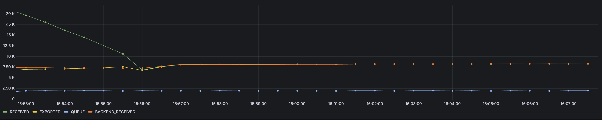

## Architecture Tests

Testing different architectures in the same load test setup to see which one is the most performant one.

## Setup
- 2 nodes
- 60 generators with 10m CPU limit
- 5 min query spans
- Agent exports directly to mock backend (no gateway involved)

### Scenario 1: ✅ Sending Queue, ✅ Batcher Exporter

| AGENT RECEIVED | AGENT EXPORTED | AGENT QUEUE | AGENT RESOURCES      | BACKEND RECEIVED |
| :------------- | :------------- | :---------- | :------------------- | :--------------- |
| 27K            | 7.31K          | 2K          | M:258/255, C:1.4/1.1 | 8.38K            |

- Agent receives more data than it exports
  - Hypothesis 1: Batching stacks the metric up, not showing the correct values
  - Hypothesis 2: Some logs are lost`
- Sending queue always full (2K)
- Looks like we're loosing logs

### Scenario 2: ✅ Sending Queue, ✅ Batch Processor

| AGENT RECEIVED | AGENT EXPORTED | AGENT QUEUE | AGENT RESOURCES      | BACKEND RECEIVED |
| :------------- | :------------- | :---------- | :------------------- | :--------------- |
| 8.27K          | 8.27K          | 1.9K        | M:122/115, C:0.5/0.5 | 8.26K            |

- Agent receives the same amount of data that it exports
- Sending queue almost full, but less than in scenario 1

### Scenario 3: ✅ Sending Queue, ❌ No Batching

| AGENT RECEIVED | AGENT EXPORTED | AGENT QUEUE              | AGENT RESOURCES      | BACKEND RECEIVED |
| :------------- | :------------- | :----------------------- | :------------------- | :--------------- |
| 6.62K          | 6.61K          | 1.99K (max. 2.95K spike) | M:114/118, C:0.4/0.4 | 6.61K            |

- Disabling batching just decreases throughput

### Scenario 4: ❌ No Queue, ❌ No Batching

| AGENT RECEIVED | AGENT EXPORTED | AGENT QUEUE | AGENT RESOURCES    | BACKEND RECEIVED |
| :------------- | :------------- | :---------- | :----------------- | :--------------- |
| 4.91K          | 4.91K          | -           | M:62/65, C:0.3/0.3 | 4.92K            |

- Disabling sending queue apparently also decreases throughput

### Scenario 5: ❌ No Queue, ✅ Batch Processor

| AGENT RECEIVED | AGENT EXPORTED | AGENT QUEUE | AGENT RESOURCES    | BACKEND RECEIVED |
| :------------- | :------------- | :---------- | :----------------- | :--------------- |
| 8.67K          | 8.67K          | -           | M:72/70, C:0.4/0.4 | 8.68K            |

### Scenario 6: ❌ No Queue, ✅ Batcher Exporter

| AGENT RECEIVED | AGENT EXPORTED | AGENT QUEUE | AGENT RESOURCES    | BACKEND RECEIVED |
| :------------- | :------------- | :---------- | :----------------- | :--------------- |
| 1.02K          | 1.02K          | -           | M:57/60, C:0.1/0.1 | 1.02K            |

- Throughput drops to the ground

## Conclusions
- Redo tests, ensuring batcher exporter has the same configuration as batch processor