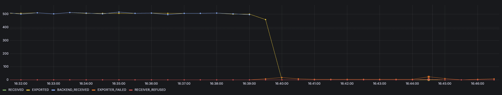

# Observations

## Transactional Setup (Clean)
- agent stops tailing/sending when backend unreachable => backpropagation works
- agent seems to be checking logs at a given interval, reading them, and then sending them to the backend in "chunks"?
- If backend goes down, agent stops tailing and exporting altogether

## Clean + Batch Processor

- No backpressure
- Agent still tails but fails to export => Logs are lost

## Clean + Exporter batcher

- Agent stops tailing, looks like backpressure works

## Left to Decide/Prove
TODO: in-memory vs persistence (does persistency really help? is it worth? how much persistency at a given rate for how many minutes of resilience?)
TODO: Gateway vs No Gateway (still not 100% clear)