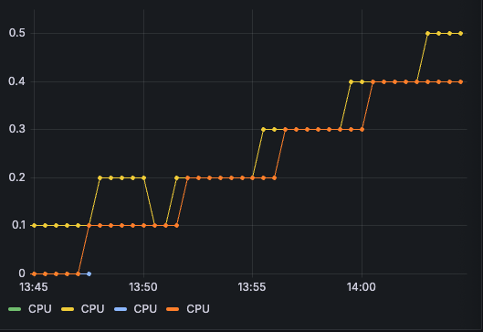
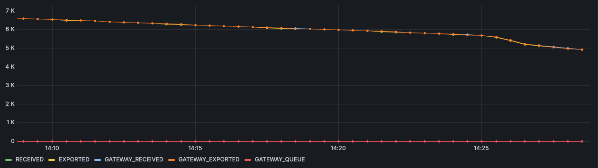
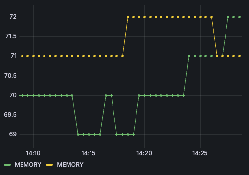
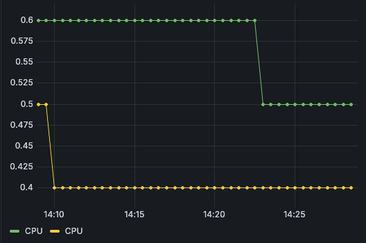
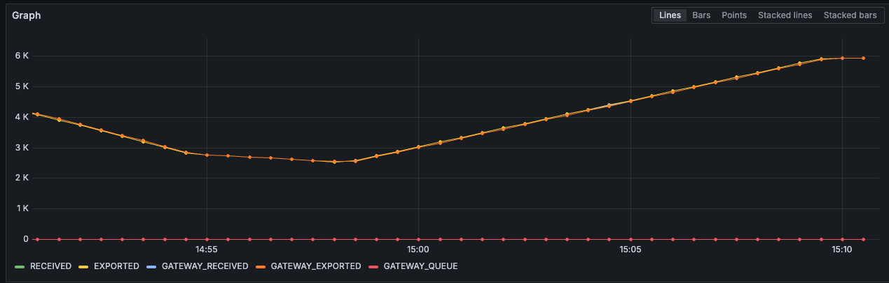
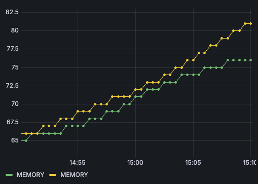
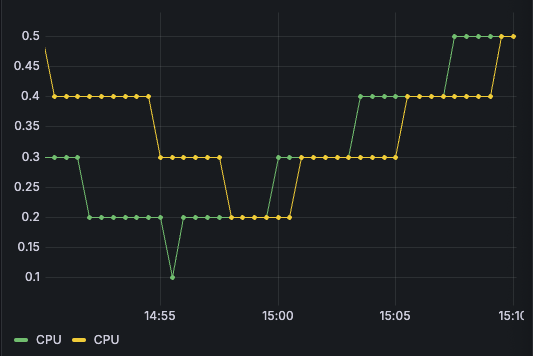
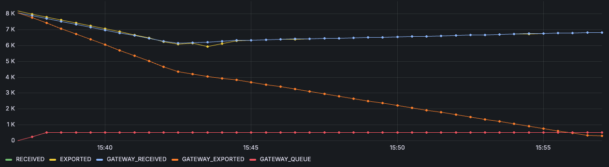
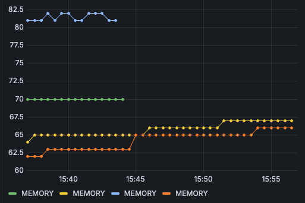
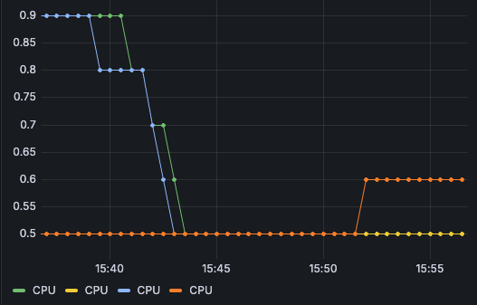

# OTel LogPipeline set-up validation

## 1. Set-up configuration steps

### With Helm

``` bash
k apply -f telemetry-manager/config/samples/operator_v1alpha1_telemetry.yaml

kh-cls-log // Execute knowledge-hub/scripts/create_cls_log_pipeline.sh with the corresponding environment variables 

helm repo add open-telemetry https://open-telemetry.github.io/opentelemetry-helm-charts

tm && helm install -n kyma-system logging open-telemetry/opentelemetry-collector -f ./docs/contributor/pocs/assets/otel-log-agent-values.yaml
```

### Manual

``` bash
k apply -f telemetry-manager/config/samples/operator_v1alpha1_telemetry.yaml

kh-cls-log // Execute knowledge-hub/scripts/create_cls_log_pipeline.sh with the corresponding environment variables 

k apply -f ./otlp-logs-validation.yaml
```

## 2. Resulting Resources

### Agent ConfigMap (OTel Config)

See [OTLP Logs Validation YAML](./otlp-logs-validation.yaml)

#### Things to take into consideration (at implementation)
- Dynamically inclusion/exclusion of namespaces, based on LogPipeline spec attributes
- Exclude FluentBit container in OTel configuration and OTel container in FluentBit configuration
- `receivers/filelog/operators`: The copy body to `attributes.original` must be avoided if `dropLogRawBody` flag is enabled


### Agent DaemonSet

See [OTLP Logs Validation YAML](./otlp-logs-validation.yaml)

### How does checkpointing work

- By enabling the storeCheckpoint preset (Helm) the `file_storage` extension is activated in the receiver
- The `file_storage` has the path `/var/lib/otelcol`
- This is later mounted as a `hostPath` volume in the DaemonSet spec
- Also set in the `storage` property of the filelog receiver

> `storage` = The ID of a storage extension to be used to store file offsets. File offsets allow the receiver to pick up where it left off in the case of a collector restart. If no storage extension is used, the receiver will manage offsets in memory only.

## 3. Benchmarking and Performance Tests Results

``` bash
k create ns prometheus
helm repo add prometheus-community https://prometheus-community.github.io/helm-charts
helm repo update
helm upgrade --install -n "prometheus" "prometheus" prometheus-community/kube-prometheus-stack -f hack/load-tests/values.yaml --set grafana.adminPassword=myPwd

k apply -f telemetry-manager/hack/load-tests/log-agent-test-setup.yaml
```

``` sql
-- RECEIVED
round(sum(rate(otelcol_receiver_accepted_log_records{service="telemetry-log-agent-metrics"}[20m])))

-- EXPORTED
round(sum(rate(otelcol_exporter_sent_log_records{service="telemetry-log-agent-metrics"}[20m])))

-- QUEUE
avg(sum(otelcol_exporter_queue_size{service="telemetry-log-agent-metrics"}))

-- MEMORY
round(sum(avg_over_time(container_memory_working_set_bytes{namespace="kyma-system", container="collector"}[20m]) * on(namespace,pod) group_left(workload) avg_over_time(namespace_workload_pod:kube_pod_owner:relabel{namespace="kyma-system", workload="telemetry-log-agent"}[20m])) by (pod) / 1024 / 1024)

-- CPU
round(sum(avg_over_time(node_namespace_pod_container:container_cpu_usage_seconds_total:sum_irate{namespace="kyma-system"}[20m]) * on(namespace,pod) group_left(workload) avg_over_time(namespace_workload_pod:kube_pod_owner:relabel{namespace="kyma-system", workload="telemetry-log-agent"}[20m])) by (pod), 0.1)
```

### Scenario: Single Pipeline
| RECEIVED | EXPORTED | QUEUE | MEMORY |  CPU  |
| :------: | :------: | :---: | :----: | :---: |
|    ?     |    ?     |   ?   |   ?    |   ?   |

### Scenario: Single Pipeline (Backpressure)
| RECEIVED | EXPORTED | QUEUE | MEMORY |  CPU  |
| :------: | :------: | :---: | :----: | :---: |
|    ?     |    ?     |   ?   |   ?    |   ?   |

### Benchmarking Sessions

#### ⏳ 13:45 - 14:05 (20 min)
- **Generator:** 10 replicas x 10 MB
- **Agent:** no CPU limit, no queue
- **Results:**
  - Agent RECEIVED/EXPORTED: 6.06K
  - Agent Memory:
    - Pod1: 70
    - Pod2: 70
  - Agent CPU:
    - Pod1: 0.5
    - Pod2: 0.4
  - Gateway RECEIVED/EXPORTED: 6.09K
  - Gateway QUEUE: 0




#### ⏳ 14:08 - 14:28 (20 min)
- **Generator:** 20 replicas x 10 MB
- **Agent:** no CPU limit, no queue
- **Results:**
  - Agent RECEIVED/EXPORTED: 4.93K
  - Agent Memory:
    - Pod1: 71
    - Pod2: 72
  - Agent CPU:
    - Pod1: 0.5
    - Pod2: 0.4
  - Gateway RECEIVED/EXPORTED: 4.93K
  - Gateway QUEUE: 0 (max. 6 at some point)





#### ⏳ 14:50 - 15:10 (20 min)
- **Generator:** 10 replicas x 20 MB
- **Agent:** no CPU limit, no queue
- **Results:**
  - Agent RECEIVED/EXPORTED: 5.94K
  - Agent Memory:
    - Pod1: 76
    - Pod2: 81
  - Agent CPU:
    - Pod1: 0.5
    - Pod2: 0.5
  - Gateway RECEIVED/EXPORTED: 5.94K
  - Gateway QUEUE: 0





#### ⏳ 15:24 - 15:34 (10 min)
- **Generator:** 10 replicas x 10 MB
- **Agent:** with CPU limit (1), no queue
- **Results:**
  - Agent RECEIVED/EXPORTED: 8.9K
  - Agent Memory: 64/62
  - Agent CPU: 0.5/0.5
  - Gateway RECEIVED/EXPORTED: 8.9K
  - Gateway QUEUE: 0

#### 🏋️‍♀️ 15:36 - 15:56 (20 min) (backpressure scenario)
- **Generator:** 10 replicas x 10 MB
- **Agent:** with CPU limit (1), no queue
- **Results:**
  - Agent RECEIVED/EXPORTED: 6.8K
  - Agent Memory:
    - Pod1: 66
    - Pod2: 67
  - Agent CPU:
    - Pod1: 0.6
    - Pod2: 0.5
  - Gateway RECEIVED: 6.8K
  - Gateway EXPORTED: 256
  - Gateway QUEUE: 328
- **Remarks:**
  - Agent does not stop when gateway refuses logs (because backpressure does not backpropagate)
  - It slows down/stops in other scenarios (see bellow) => SUCCESS





#### 🪲 Agent exports logs to a debug endpoint (5 min)
- no networking involved
- 12/14 log generators x 10 MB
  - 19.5K => ~20K
  - MEM: 43/47
  - CPU: 0.7/0.8

#### 🪲 Agent exports logs directly to mock backend (5 min)
- networking, but avoiding gateway
- 10 log generators x 10 MB
  - 5.3K
  - MEM: 58/59
  - CPU: 0.4/0.5
- 12 log generators x 10 MB
  - not increasing


#### 🪲 Agent exports logs directly to mock backend with batching processor (5 min)
- networking, but with batching mechanism in-place
- 10 log generators x 10 MB, batch size: 1024
  - 8.3K
  - MEM: 68/73
  - CPU: 0.5/0.6
- 12 log generators x 10 MB, batch size: 1024
  - starts decreasing (~7.5K)
- 10 log generators x 10 MB, batch size: 2048
  - ~9K
  - MEM: 74/79
  - CPU: 0.6/0.7

#### ⏳ 13:46 - 14:06 (20 min)
- **Generator:** 10 replicas x 10 MB
- **Agent:** with CPU limit (1), no queue, with batch processing (1024)
- **Results:**
  - Agent RECEIVED/EXPORTED: 8.46K
  - Gateway RECEIVED/EXPORTED: 8.46K
  - Agent Memory: 69/76
  - Agent CPU: 0.5/0.7
  - Gateway QUEUE: 0 (max 191)


#### ⏳ ??:?? - ??:?? (20 min)
- **Generator:** 10 replicas x 10 MB
- **Agent:** with CPU limit (1), no queue, with batch processing (2048)
- **Results:**
  - lower throughput as for the 1024 scenario

#### ⏳⭐️ 15:55 - 16:15 (20 min)
- **Agent:** with CPU limit (1), no queue, with batch processing (1024)
- **Mock Backend:** memory limit x2 (2048Mi)
- **Generator:** 10 replicas x 10 MB
  - **Results:**
    - Agent RECEIVED/EXPORTED: 8.18K
    - Gateway RECEIVED/EXPORTED: 8.18K
    - Agent Memory: 70/71
    - Agent CPU: 0.6/0.6
    - Gateway QUEUE: 0
- **Generator:** 12 replicas x 10 MB (16:18 - 16:35)
  - **Results:**
    - Agent RECEIVED/EXPORTED: 8.6k
    - Gateway RECEIVED/EXPORTED: 8.6k
    - Agent Memory: 73/74
    - Agent CPU: 0.7/0.6
    - Gateway QUEUE: 0
- - **Generator:** 14 replicas x 10 MB (16:35 - 16:40)
  - **Results:**
    - Agent RECEIVED/EXPORTED: 7.54K
    - Gateway RECEIVED/EXPORTED: 7.54K
    - lower

#### ⏳ 16:50 - 17:10 (20 min)
- **Generator:** 12 replicas x 10 MB
- **Agent:** with CPU limit (1), no queue, with batch processing (2048)
- **Mock Backend:** memory limit x2 (2048Mi)
- **Results:**
  - Agent RECEIVED/EXPORTED: 8.1K
  - Gateway RECEIVED/EXPORTED: 8.11K
  - Agent Memory: 74/81
  - Agent CPU: 0.6/0.5
  - Gateway QUEUE: 0 (max 2)

TODO: Try the container-parser for the filelog receiver instead of the regex-parser (unrelated to performance)